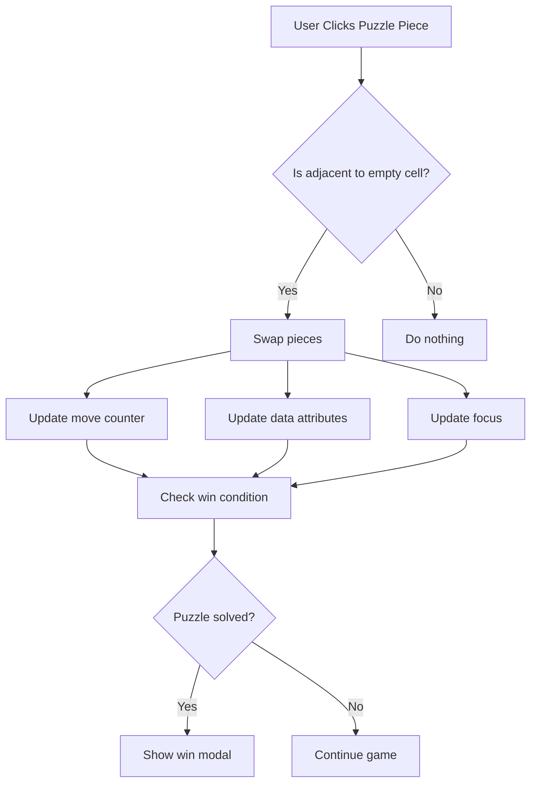

# Fixing Piece Movement in Racha Cuca Puzzle Game

## Overview

The Racha Cuca puzzle game has an issue where puzzle pieces are not moving correctly when clicked. When a player clicks on a piece adjacent to the empty space, the pieces should swap positions, but this functionality is not working properly.

## Problem Analysis

The root cause of the issue is in the `swapImagePosition` method in `JS/main.js`. The method incorrectly identifies the empty cell by checking for an empty `src` attribute rather than the `empty-cell` CSS class, and it doesn't properly update data attributes after swapping.

### Current Issues:

1. Incorrect identification of empty cells
2. Missing data attribute updates after swapping
3. Incomplete focus management

## Solution Design

### 1. Fix the swapImagePosition Method

The `swapImagePosition` method needs to correctly identify empty cells by checking for the `empty-cell` CSS class and properly update all data attributes after swapping.

### 2. Update the handleImageClick Method

The click handler needs to properly identify valid moves and trigger swaps correctly, only updating the move counter when a valid move is made.

### 3. Improve Win Condition Checking

Ensure the win condition properly validates the solved state after each move.

## Implementation Plan

The fixes will be implemented in the `SlidingPuzzleGame` class in `JS/main.js`.

#### Method: swapImagePosition

The `swapImagePosition` method needs to be updated to:

1. Correctly identify the empty cell by checking for the `empty-cell` CSS class rather than an empty `src` attribute
2. Properly swap the images between the clicked cell and the adjacent empty cell
3. Update all relevant data attributes (position, row, column) for both cells
4. Update the CSS classes to reflect which cell is now empty
5. Move the keyboard focus to the cell that was moved

#### Method: handleImageClick

The `handleImageClick` method needs to be updated to:

1. Check all adjacent cells (left, right, above, below) for the empty cell
2. Attempt to swap with any adjacent empty cell
3. Only update the move counter if a swap actually occurred
4. Check for win condition after a successful move

## Data Flow

## Testing Plan

### Unit Tests

1. Test that clicking a piece adjacent to the empty space swaps the pieces
2. Test that clicking a piece not adjacent to the empty space does nothing
3. Test that the move counter increments only when a valid move is made
4. Test that the win condition is properly detected when the puzzle is solved
5. Test that focus correctly moves to the piece that was moved

### Manual Testing

1. Start a new game and verify pieces can be moved
2. Try clicking pieces not adjacent to the empty space
3. Complete a puzzle and verify the win modal appears
4. Verify the move counter updates correctly
5. Test with different difficulty levels (3x3, 4x4, 5x5)

## Security Considerations

No security implications as this is a client-side browser game with no user input validation requirements.

## Performance Considerations

The fix maintains the existing performance characteristics:

- Uses DocumentFragment for efficient DOM updates
- Uses canvas pooling for image processing
- Maintains existing event delegation pattern

## Backward Compatibility

The changes are fully backward compatible as they only fix the existing functionality without changing the API or data structures.
