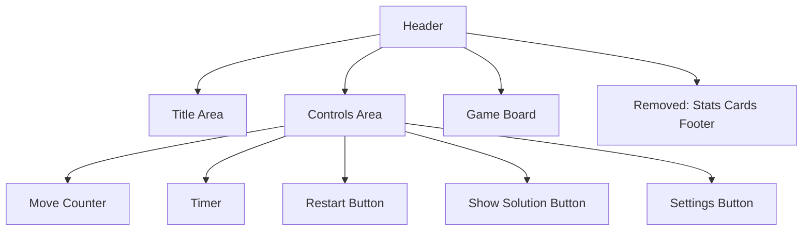

# UI Redesign: Move Game Stats to Header

## Overview

This design document outlines the changes needed to remove the separate cards for moves and time from the game footer and integrate this information directly into the header controls next to the restart button.

## Current UI Structure

The current UI has:

- Header with title and control buttons (Restart, Show Solution, Settings)
- Main game board area
- Footer with two stat cards (Moves and Time)

## Proposed Changes

1. Remove the `.game-footer` section containing the stat cards
2. Add move counter and timer directly to the `.header-controls` area
3. Adjust styling to accommodate the new elements in the header

## Detailed Implementation Plan

### 1. HTML Structure Changes

- Remove the entire `.game-footer` div from the game panel
- Add move counter and timer elements to the `.header-controls` div
- Position these elements before the restart button for better grouping

### 2. CSS Styling Updates

- Create new styles for compact stat displays in the header
- Adjust spacing and alignment in the header controls
- Ensure responsive behavior on smaller screens

### 3. JavaScript Updates

- Modify the `updateMoveCounter()` method to update the new header element
- Modify the `updateTimerDisplay()` method to update the new header element
- Ensure the elements are properly initialized on page load

## Visual Representation



## Implementation Details

### HTML Modifications

1. Remove the entire `<div class="game-footer">` section
2. Add new elements to the `<div class="header-controls">`:
   ```html
   <div class="header-stats">
     <span class="header-stat">
       <span class="stat-label">Moves:</span>
       <span id="contadorDeJogada" class="stat-value">0</span>
     </span>
     <span class="header-stat">
       <span class="stat-label">Time:</span>
       <span id="timer" class="stat-value">00:00</span>
     </span>
   </div>
   ```

### CSS Modifications

1. Add new styles for `.header-stats` and `.header-stat`
2. Adjust `.header-controls` layout to accommodate the new elements
3. Ensure proper spacing and alignment

### JavaScript Considerations

The existing JavaScript methods `updateMoveCounter()` and `updateTimerDisplay()` already target elements by their IDs, so they should continue to work without modification as long as the elements retain the same IDs.

## Responsive Design Considerations

- On smaller screens, the stats might need to be stacked vertically
- Font sizes may need adjustment for different screen sizes
- Consider hiding labels on very small screens and showing only values

## Accessibility

- Ensure proper ARIA labels for the new stat elements
- Maintain keyboard navigation flow
- Preserve screen reader compatibility

## Specific Implementation Steps

### 1. Update index.html

- Remove the `<div class="game-footer">` section which contains the current stats cards
- Modify the `<div class="header-controls">` to include the stats before the buttons

### 2. Update style.css

- Add styles for the new header stats elements
- Remove or comment out unused styles for the old game-footer

### 3. JavaScript Compatibility

- No changes needed to main.js since it uses getElementById to update the stats
- The existing element IDs ("contadorDeJogada" and "timer") will be preserved

## CSS Classes to Add

```css
.header-stats {
  display: flex;
  align-items: center;
  gap: 1rem;
  margin-right: 1rem;
  padding: 0.5rem;
  background: rgba(255, 255, 255, 0.2);
  border-radius: var(--border-radius);
}

.header-stat {
  display: flex;
  align-items: center;
  gap: 0.5rem;
}

.stat-label {
  font-weight: 500;
  color: white;
}

.header-stat .stat-value {
  font-weight: 700;
  font-size: 1.1rem;
  color: white;
  min-width: 3rem;
  text-align: center;
}
```

## Updated Header Controls Structure

```html
<div class="header-controls">
  <div class="header-stats">
    <span class="header-stat">
      <span class="stat-label">Moves:</span>
      <span id="contadorDeJogada" class="stat-value">0</span>
    </span>
    <span class="header-stat">
      <span class="stat-label">Time:</span>
      <span id="timer" class="stat-value">00:00</span>
    </span>
  </div>
  <button
    type="button"
    id="reiniciarJogo"
    onclick="reiniciarJogo()"
    class="btn btn-warning header-btn"
    aria-label="Restart game"
  >
    Restart
  </button>

  <button
    type="button"
    id="imagemAjudar"
    onclick="imagemAjudar()"
    class="btn btn-info header-btn"
    aria-label="Show help image"
  >
    Show Solution
  </button>

  <button
    type="button"
    id="openConfigBtn"
    onclick="openConfiguration()"
    class="btn btn-config header-btn"
    aria-label="Open configuration"
  >
    <span class="config-icon">⚙️</span> Settings
  </button>
</div>
```

## Testing Plan

### Visual Testing
1. Verify that the new header stats display correctly on different screen sizes
2. Confirm that the move counter increments properly when making moves
3. Confirm that the timer updates every second
4. Check that all buttons function correctly with the new layout

### Functional Testing
1. Test game restart functionality to ensure move counter and timer reset
2. Verify that the configuration panel still opens and closes correctly
3. Test the help image functionality
4. Confirm that win detection and modal display still work properly

### Responsive Testing
1. Check layout on mobile devices (width < 768px)
2. Verify that elements stack properly on small screens
3. Confirm that text remains readable on all screen sizes

### Accessibility Testing
1. Verify that keyboard navigation still works correctly
2. Confirm that screen readers can access the new stat elements
3. Check that focus indicators are visible for all interactive elements

## Conclusion

This redesign will improve the user interface by moving the game statistics to a more prominent location in the header, making them easily visible without taking up valuable space in the footer. The implementation preserves all existing functionality while providing a cleaner, more modern interface. The changes are minimal and focused, reducing the risk of introducing bugs while enhancing the user experience.
